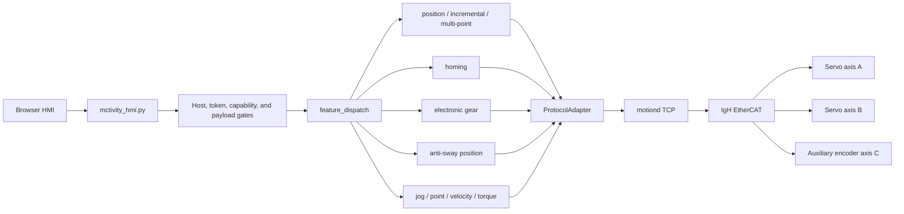
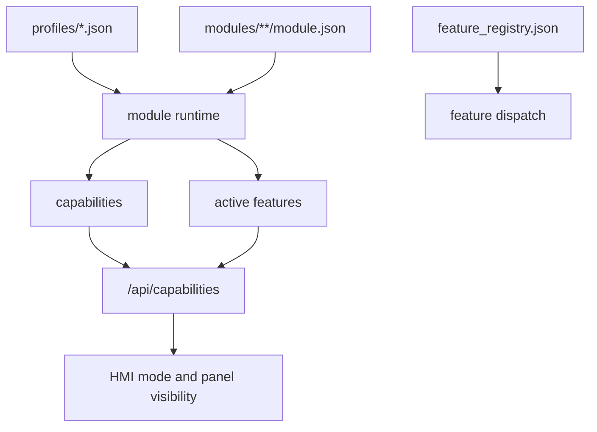
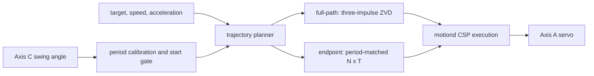

# Architecture

## Layers

`mctivity v1.4.0-preview.3` is organized as four layers:

1. browser HMI and local HTTP API
2. profile/module/capability assembly
3. feature dispatch and protocol adapters
4. `motiond`, IgH EtherCAT, drives, and auxiliary encoder

## Runtime Flow



## Assembly Flow



A motion feature normally has a logic module and an HMI module. The profile selects modules, module manifests declare dependencies and capabilities, and the feature registry owns modes and commands.

## Profiles

- `minimal`: axis feedback, control panel, and single-point positioning
- `standard`: minimal plus incremental, jog, point, multi-point, homing, and velocity
- `full`: standard plus dual-axis access, auxiliary encoder, torque, electronic gearing, and anti-sway

Profiles control HMI/API exposure. Missing module dependencies are resolved fail-closed: the incomplete feature is omitted and reported in `warnings`. Profiles do not discover EtherCAT slaves or rewrite PDO layouts.

## Main Feature Pairs

- `feature-logic-single-point` + `feature-hmi-single-point`
- `feature-logic-anti-sway-position` + `feature-hmi-anti-sway-position`
- `feature-logic-incremental` + `feature-hmi-incremental`
- `feature-logic-jog` + `feature-hmi-jog`
- `feature-logic-point` + `feature-hmi-point`
- `feature-logic-multi-point` + `feature-hmi-multi-point`
- `feature-logic-homing` + `feature-hmi-homing`
- `feature-logic-velocity` + `feature-hmi-velocity`
- `feature-logic-torque` + `feature-hmi-torque`
- `feature-logic-electronic-gear` + `feature-hmi-electronic-gear`

Device and display modules:

- `feature-logic-dual-axis-fv3` + `feature-hmi-dual-axis-fv3`
- `feature-logic-aux-encoder`

## Anti-Sway Path



This release is open-loop anti-sway. Axis C is used for angle monitoring, period calibration, start-phase gating, and result evaluation. Its angle is not used for real-time trajectory correction.

## Homing Path

Homing is an exclusive control mode with two operations:

- set the current physical position to a configured coordinate
- move toward an obstruction, detect a sustained torque threshold, assign the corresponding end coordinate, and back off by the configured distance

Obstruction homing uses timeout, maximum search distance, torque hold, controlled deceleration, and servo/EtherCAT readiness checks. Because it establishes the coordinate system, it does not use the existing software coordinate envelope during the search.

## Basic Fault Status

Device fault flags and raw error codes pass through the existing status API to the control panel. The panel displays the raw hexadecimal value and a generic fault state, without identifying a manufacturer alarm or suggesting repairs. Manual fault reset remains an explicit control action; observing a fault does not send a reset or motion command.

## EtherCAT Topology

The supplied daemon expects:

```text
Slave 0: primary servo axis
Slave 1: secondary servo axis
Slave 2: SICK AFM60A auxiliary encoder
```

Set `MCTIVITY_AUX_ENCODER_ENABLED=0` to disable the third slave configuration. The two servo definitions remain required. Other slave orders, products, or PDO layouts need code/configuration changes.

## API Boundary

- `GET /api/status`
- `GET /api/ui_state`
- `POST /api/ui_state`
- `GET /api/capabilities`
- `GET /api/health/modular`
- `POST /api/command`

The HMI validates hosts, configured API tokens, browser origin/content type, command ownership, mode ownership, payload fields, and integer motion bounds before dispatch. `mctivity_ctl.py` connects directly to `motiond` and bypasses these HMI gates; keep it local and trusted.
