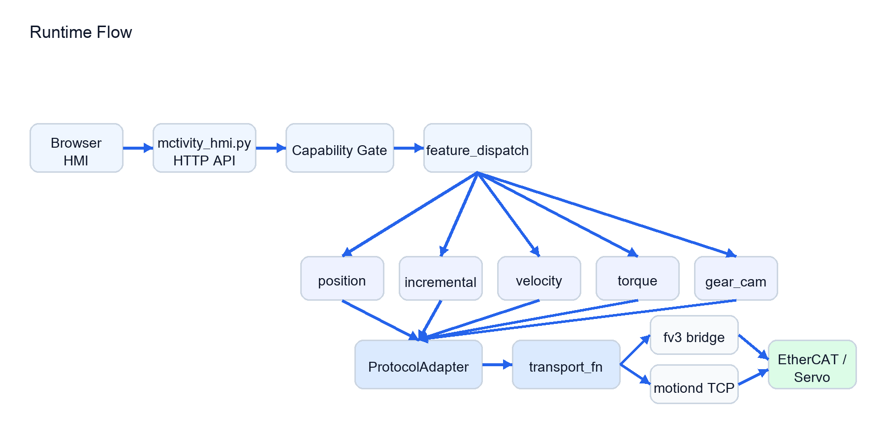
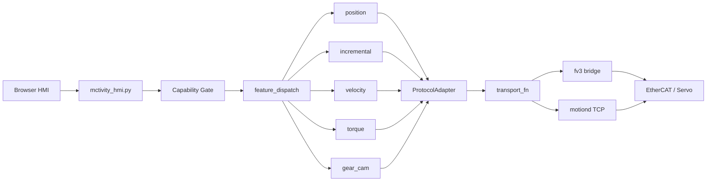
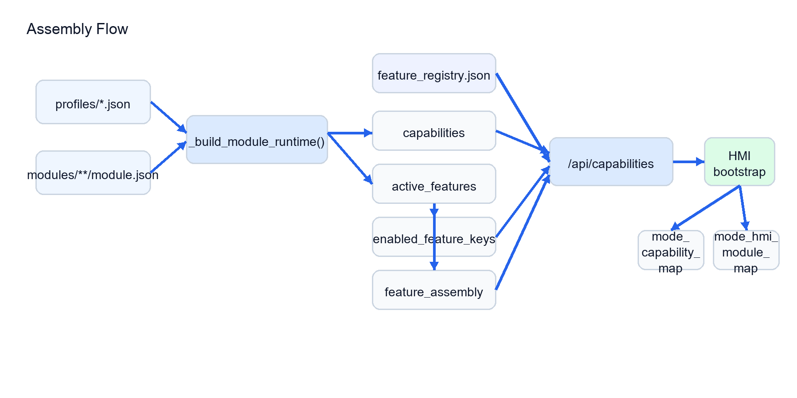
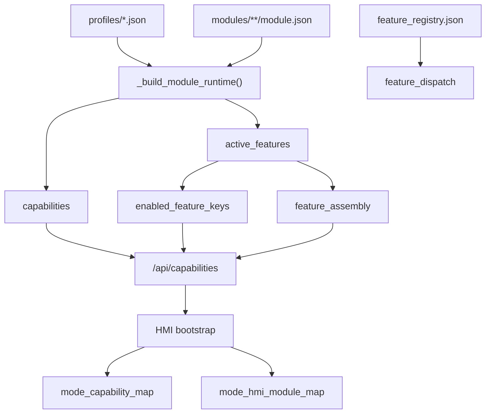
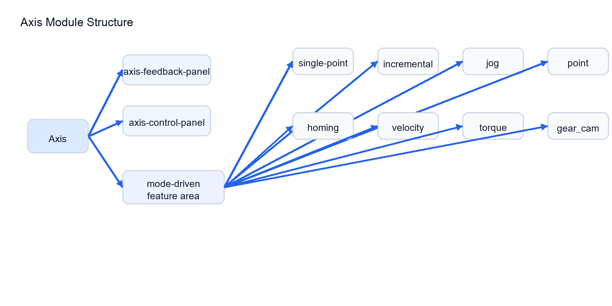
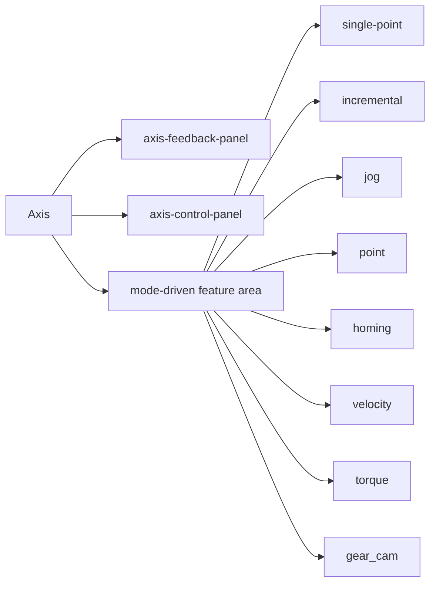
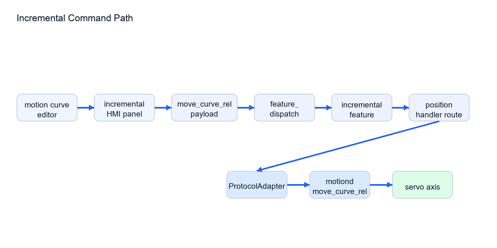

# Architecture

## Overall Structure

`mctivity v1.2.0` can be understood as four layers:

1. runtime UI/API shell
2. modular assembly layer
3. feature dispatch layer
4. motion transport/device layer

## Runtime Flow

## Assembly Flow

## Axis Module Structure

## Functional Modules

Base axis modules:

- `axis-feedback-panel`
- `axis-control-panel`

Current logic/HMI feature pairs:

- `feature-logic-single-point` + `feature-hmi-single-point`
- `feature-logic-incremental` + `feature-hmi-incremental`
- `feature-logic-jog` + `feature-hmi-jog`
- `feature-logic-point` + `feature-hmi-point`
- `feature-logic-homing` + `feature-hmi-homing`
- `feature-logic-velocity` + `feature-hmi-velocity`
- `feature-logic-torque` + `feature-hmi-torque`
- `feature-logic-electronic-gear` + `feature-hmi-electronic-gear`

Device-level modules:

- `feature-logic-dual-axis-fv3` provides `axis.device.fv3.access`
- `feature-hmi-dual-axis-fv3` exposes Axis B in HMI when the capability is active

## Incremental Command Path

```mermaid
flowchart LR
    EDITOR["motion curve editor"] --> PANEL["incremental HMI panel"]
    PANEL --> CMD["move_curve_rel payload"]
    CMD --> DISP["feature_dispatch"]
    DISP --> INC["incremental feature"]
    INC --> POSH["position handler route"]
    POSH --> ADAPTER["ProtocolAdapter"]
    ADAPTER --> MOTION["motiond move_curve_rel"]
    MOTION --> AXIS["servo axis"]
```

## Main Interface Relationships

### position

Input:

- `set_mode(position)`
- `move_abs`
- `move_rel`

Output:

- position motion commands to motion transport

### incremental

Input:

- `set_mode(incremental)`
- `move_curve_rel`
- motion-curve editor parameters

Output:

- incremental curve motion command

### velocity

Input:

- `set_mode(velocity)`
- `jog_velocity`

Output:

- velocity motion command

### torque

Input:

- `set_mode(torque)`
- `torque_cmd`

Output:

- torque staging or torque-mode command transport

Current note:

- in this release the torque panel is wired into modular dispatch, but the HMI copy still describes the command path as staged only

### gear_cam

Input:

- `set_mode(gear_cam)`
- `gear_config`
- `gear_start`
- `gear_stop`

Output:

- electronic gearing commands

## Backend Interfaces

- `GET /api/status`
- `GET /api/ui_state`
- `POST /api/ui_state`
- `GET /api/capabilities`
- `GET /api/health/modular`
- `POST /api/command`

Command gate:

- request Host must be in the HMI allowlist before the API is served
- command/state POST requests must be same-origin browser requests and use `application/json`
- command names must be present in the HMI whitelist
- `set_mode` mode names must be present in the mode whitelist
- only whitelisted payload fields are forwarded to motion transport
- forwarded command fields use stable order with `cmd` first and `device` second
- integer motion parameters are strictly parsed and checked against configurable motion limits before transport
- `move_curve_rel` accepts only known blend names and does not forward its UI-only `mode` field to `motiond`
- `motiond` field lookup matches JSON keys only; required numeric command fields are rejected when invalid, while HMI API validation should be used for public command access

Device gate:

- Axis A uses `mctivity`
- Axis B uses `fv3`
- `fv3` requests require `axis.device.fv3.access`
- v1.2.0 `motiond` still expects the current two-slave EtherCAT topology; profiles control HMI/API exposure, not EtherCAT slave discovery

## Adapter Interfaces

Current adapter methods:

- `wait_motion_ready(device)`
- `apply_fv3_profile(payload)`
- `fv3_set_mode(mode)`
- `fv3_force_csp()`

Low-level CLI note:

- `mctivity_ctl.py` connects directly to `motiond`
- it does not apply HMI profile/capability gates
- use it as a local service/debug client, not as the public API boundary
